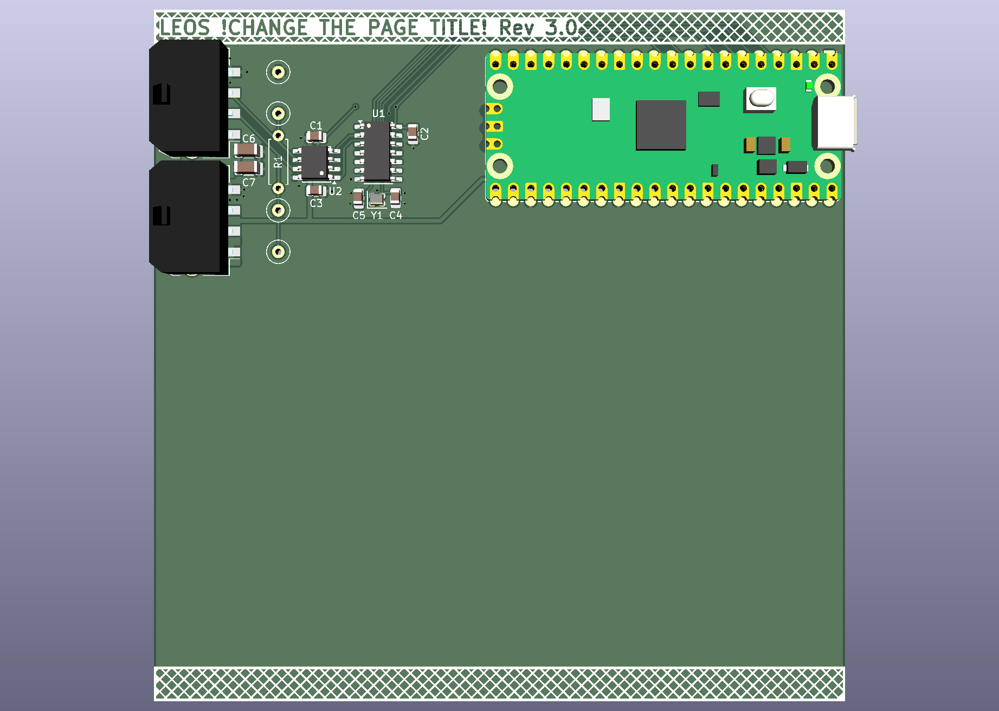

# LEOS Stack PCB Template

This repository is the starting-point PCB template for VIP Lightning From the Edge of Space (LEOS). **All LEOS modules should be spun off from this template** so that every module begins with the standard Raspberry Pi Pico, CAN-FD network, stack connectors, board shape, and mechanical layout.

## Create a module repository from this template

Do not fork or clone this repository as the permanent home of a new module. Create a fresh repository from the public GitHub template instead:

1. Open this template repository on GitHub.
2. Select **Use this template**, then **Create a new repository**.
3. Choose the LEOS organization as the owner and enter the new module's repository name and description.
4. Leave **Include all branches** unchecked unless the module specifically needs work from non-default template branches.
5. Choose public visibility, then select **Create repository**.
6. Clone the newly created repository and open `LEOS-stack-template.kicad_pro` in KiCad.

GitHub also allows this template to be selected from the **Repository template** menu while creating a new repository. See GitHub's [repository template instructions](https://docs.github.com/en/repositories/creating-and-managing-repositories/creating-a-repository-from-a-template) for the current interface.

## Before designing

- Rename the root KiCad project, schematic, and PCB files for the module.
- Change the root sheet/page title in both the schematic and PCB. Rename or add schematic sheets so their names clearly describe each circuit domain.
- Update the **date** and **revision** in both the schematic and PCB Page Settings. These fields are used in the PCB silkscreen, so stale metadata will be manufactured onto the board.
- Replace the template title and delete the instructional text box on the root schematic once it is no longer needed.
- Use separate schematic sheets to isolate circuit domains, and document the design well enough for the schematic to explain itself.

## Design expectations

- Use [pinout.xyz](https://pinout.xyz/) with the Pico 2 view when selecting configurable pins. Avoid using SPI0 for other devices because it is reserved for the high-throughput CAN bus; SPI1, I2C0, and UART0 are exposed as starting interfaces.
- Keep the standard CAN-FD and stack-connector circuitry intact unless a reviewed module requirement calls for a change.
- Verify that every schematic symbol, PCB footprint, and selected BOM item agree. Record the manufacturer, manufacturer part number (MPN), and DigiKey information for each part.
- Prefer practical, hand-placeable packages such as SOIC, 0805, 1206, SOT, and TSSOP. Do not choose extremely small packages when a larger suitable option exists.
- Commit coherent, incremental changes with descriptive messages. Do not commit generated outputs, junk files, or Gerbers when they can be regenerated from the KiCad sources.
- Review the schematic, layout, footprints, sourcing, and manufacturer recommendations before ordering hardware.
